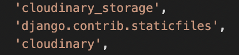

# **PetFriends - API**

This is a content sharing platform for your pets, any pet can sign up! 
The site includes registration and sign up, adding posts, comments, follow or unfollow a user, vote or downvote a post, save a post for future viewing.
This project is the last of five projects that needs to be completed in order to receive a diploma in Software Development from The Code Institute.

A live version of this API will be found here: https://petfriends-api.herokuapp.com/

* Deployed FrontEnd - https://pet-friends.herokuapp.com/

* Deployed BackEnd API - https://petfriends-api.herokuapp.com/

* BackEnd Repo - https://github.com/JodyMurray/my-api.git

* FrontEnd Repo - https://github.com/JodyMurray/petfriends.git


Test Account:

## **Table of Contents** ##

* [Database Schema](#database-schema)
* [User Stories](#user-stories)
* [Testing](#testing)
    * [Validators](#validators)
    * [Manual Testing](#manual-testing)
* [Technologies Used](#technologies-used)
    * [Languages](#languages)
    * [Libraries, Frameworks & Programs](#libraries-frameworks-&-programs)
* [Bugs](#bugs)
    * [Solved](#solved)
    * [Unresolved](#unresolved)
* [Project Setup](#project-setup)
* [Deployment](#deployment)
* [Credits](#credits)
    * [Media](#media)
    * [Content](#content)
    * [Sources](#sources)


------------------------------------------------------------------------------------------------------------


## **Database Schema**

IMAGE

## **User Stories**

[User Stories](https://github.com/users/JodyMurray/projects/11/views/1)

## **Testing**

### Validators

### Manual Testing

## **Technologies Used**

### Languages

- Python
- Django
- Django Rest Framework

### Libraries, Frameworks & Programs

- Cloudinary Storage
- Django rest auth
- Postgre SQL
- Pillow 
- Django rest framework
- QuickBaseDiagrams (for the database schema diagram)

## **Bugs**
### Solved
### Unresolved

## **Project Setup**

* Create a new repository using the Code Institute template repository.
* Run the command pip3 install 'django<4' in the terminal to install Django.
* Run the command django-admin startproject my_api . in the terminal.
* Run the command pip install django-cloudinary-storage in the terminal to install Cloudinary Storage.
* Run the command pip install Pillow - this library adds image processing capabilities we need for this project.
* Once these dependencies are installed we need to add them into the "Installed apps" section in settings.py.
    * Note the placement and terms used for this input into installed apps:

    <br>

    

* Create env.py file in the top directory.
    * Inside the env.py file, import the os module and set up the os.environ with the cloudinary URL you can retrieve from the account you've set up.
* In the settings.py file, set up a variable called "CLOUDINARY_STORAGE" and use the environment variable used to set up in the env.py file to declare this value.
* Next, define the setting called "MEDIA_URL" and set it to "/media/" so the settings know where to store our image files.
* Finally, define a variable called "DEFAULT_FILE_STORAGE" and set it to "MediaCloudinaryStorage".


## **Deployment**

First step of deployment is setting up the JWT tokens:
* Firstly install the package in the terminal window, using the command: 
    
    *pip install dj-rest-auth==2.1.9*
* In the settings.py file add the following to the "Installed Apps" section.

    *'rest_framework.authtoken',*

    *'dj_rest_auth',*

* Next, add the following urls to the urlpatterns list:

    *path('dj-rest-auth/', include('dj_rest_auth.urls')),*

* In the command terminal, migrate the database just added by typing:

    *python manage.py migrate*

* Next we want to add the feature to enable registration of users. Type the following into the terminal:

    *pip install 'dj-rest-auth[with_social]'*

* Add the following into the "Installed Apps" section in the settings.py file:

    *'django.contrib.sites',*

    *'allauth',*

    *'allauth.account',*

    *'allauth.socialaccount',*

    *'dj_rest_auth.registration',*

* Add SITE_ID value, which is placed under INSTALLED APPS List:
    *SITE_ID = 1*


* Next add the registration urls to the urlpatterns list, as follows:
    *path('dj-rest-auth/registration/',* 

    *include('dj_rest_auth.registration.urls')),*

* Now add JWT tokens functionality: 
    * Install the djangorestframework-simplejwt package by typing the following into the terminal command window:
        *pip install djangorestframework-simplejwt==4.7.2*

* In the env.py file, create a session authentication value (differentiates between Dev and Prod mode):
    *os.environ['DEV'] = '1'*

* In the settings.py file, use the Dev value above to differentiate between Dev and Prod Modes & add pagination which is placed under SITE_ID:

    ```REST_FRAMEWORK = {
    'DEFAULT_AUTHENTICATION_CLASSES': [( 
        'rest_framework.authentication.SessionAuthentication' 
        if 'DEV' in os.environ 
        else 'dj_rest_auth.jwt_auth.JWTCookieAuthentication'
    )]
    }
    ```
* To enable token authentication, put the following under the above step:

    *REST_USE_JWT = True*

* To ensure tokens sent over HTTPS only, add the following:

    *JWT_AUTH_COOKIE = 'my-app-auth'*

* Next, declare cookie names for the access and refresh tokens by adding:
    ```
    JWT_AUTH_SECURE = True
    JWT_AUTH_REFRESH_COOKIE = 'my-refresh-token'
    ```

* Create a new serializers.py file in the api folder.

* Import the following files at the top of the new serializers file:

    *from dj_rest_auth.serializers*

    *import UserDetailsSerializer*

    *from rest_framework import serializers*

* Next create the profile_id and profile_image fields:
    ````
    class CurrentUserSerializer(UserDetailsSerializer):
        profile_id = serializers.ReadOnlyField(source='profile.id')
        profile_image = serializers.ReadOnlyField(source='profile.image.url')
        class Meta(UserDetailsSerializer.Meta):
            fields = UserDetailsSerializer.Meta.fields + ('profile_id', 'profile_image')
```


## **Credits**

- The DRF API walkthrough was used as a guide for this API, it served as a major help in creating this API.
- My mentor at Code Institute - Martina Terlevic.
- Keiron Chaudhry, a fellow student and great support!

## **Media**
## **Content**
